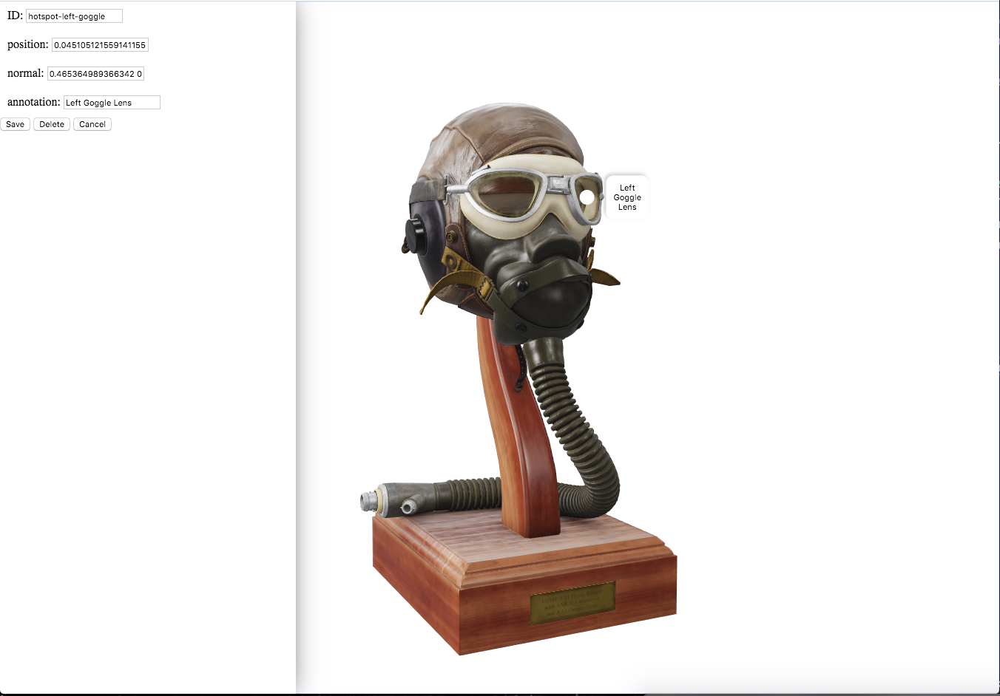

# Demo space for Model-Viewer-Studio

## Instructions

Clone this repo and execute the model-viewer-studio app. This will load the HTML files containing a model-viewer tag and make it editable in model-viewer-studio.

```bash
git clone https://github.com/heyMP/model-viewer-studio-demos.git
cd model-viewer-studio-demos
npx model-viewer-studio flight-helmet/index.html
```

note: `npx` require node version 10 or higher.


Visit http://localhost:3000

Click the `edit hotspots` button in the top left corner. Add a few hotspots and click save. Those hotspots will now be saved in the example html file. 

